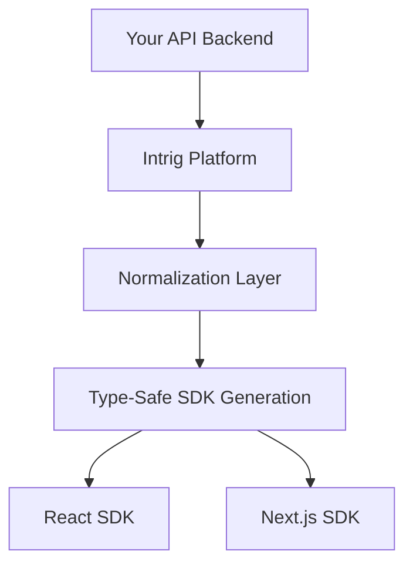

# Core Overview

Intrig is built around a simple yet powerful architecture that connects your API backend to your frontend applications through automatically generated, type-safe SDKs.

## Architecture



### Core Components

#### 1. API Discovery & Normalization
- Automatically discovers your API endpoints
- Normalizes different API patterns into consistent schemas
- Handles authentication and authorization requirements

#### 2. Code Generation Engine
- Generates framework-specific SDKs from normalized schemas
- Produces type-safe TypeScript code
- Optimizes for each framework's best practices

#### 3. CLI Tools
- Command-line interface for managing the development workflow
- Exploration tools for understanding your API
- Configuration and customization options

#### 4. Development Workflow
- Real-time synchronization between backend changes and frontend code
- Automatic regeneration when APIs change
- Seamless integration with existing development processes

## Key Concepts

### Endpoints
Intrig automatically discovers and catalogs all your API endpoints, creating a comprehensive map of your API surface area.

```typescript
// Automatically discovered and typed
const users = await intrig.users.list();
const user = await intrig.users.get({ id: '123' });
const newUser = await intrig.users.create({ name: 'John', email: 'john@example.com' });
```

### Schemas
Type definitions are extracted from your API responses and normalized into TypeScript interfaces.

```typescript
interface User {
  id: string;
  name: string;
  email: string;
  createdAt: Date;
  updatedAt: Date;
}
```

### Authentication
Intrig handles various authentication patterns automatically, including:
- Bearer tokens
- API keys
- Cookie-based auth
- Custom authentication schemes

### Error Handling
Rich error objects with structured information:

```typescript
try {
  await intrig.users.create(userData);
} catch (error) {
  if (error.status === 422) {
    console.log('Validation errors:', error.details);
  }
}
```

## Development Workflow

### 1. Initial Setup
```bash
# Install Intrig CLI
npm install -g intrig-cli

# Initialize in your project
intrig init

# Connect to your API
intrig add --url https://api.example.com
```

### 2. Generate SDK
```bash
# Sync API changes and generate SDK
intrig sync --all && intrig generate
```

### 3. Use in Application
```typescript
import { intrig } from './generated/intrig-sdk';

// Type-safe API calls
const users = await intrig.users.list();
```

### 4. Handle API Changes
When your backend API changes:

1. **Restart your Intrig application** to ensure changes are loaded
2. **Run sync command** to detect changes
3. **Regenerate SDK** to update frontend types
4. **TypeScript compiler** will catch any breaking changes

## Configuration

### Basic Configuration
Intrig works with minimal configuration, but can be customized:

```json
{
  "apis": [
    {
      "name": "main-api",
      "url": "https://api.example.com",
      "auth": {
        "type": "bearer",
        "token": "${API_TOKEN}"
      }
    }
  ],
  "generate": {
    "output": "./src/generated",
    "frameworks": ["react", "next"]
  }
}
```

### Advanced Configuration
- Custom type mappings
- Framework-specific optimizations
- Error handling strategies
- Caching configurations

## Framework Adapters

Intrig generates optimized code for each supported framework:

### React
- Custom hooks with Suspense support
- Error boundary integration
- Optimistic updates


### Next.js
- Server actions
- API route handlers
- Middleware support

## Best Practices

### 1. API Design
- Use consistent naming conventions
- Provide clear error messages
- Include proper HTTP status codes
- Document your endpoints

### 2. Frontend Integration
- Handle loading and error states
- Implement proper error boundaries
- Use optimistic updates where appropriate
- Cache responses intelligently

### 3. Team Workflow
- Always restart Intrig after API changes
- Run sync before major frontend work
- Review generated code changes in PRs
- Keep generated files in version control

## Next Steps

Now that you understand Intrig's core concepts, explore:

- [CLI Reference](./cli) - Detailed command documentation
- [Configuration Guide](./configuration) - Advanced setup options
- [Framework Adapters](../adapters/react/setup) - Framework-specific guides
- [Troubleshooting](./troubleshooting) - Common issues and solutions