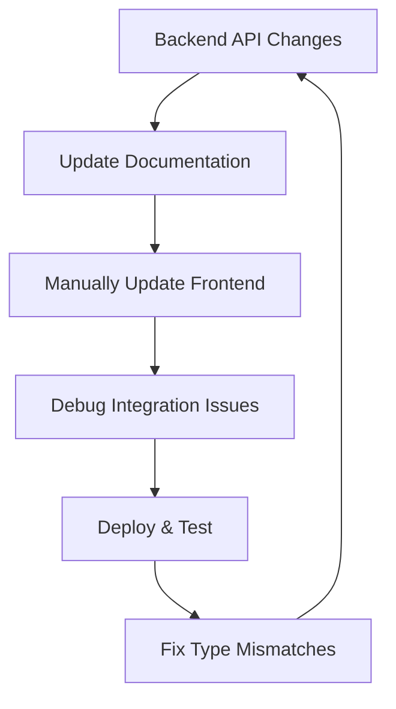
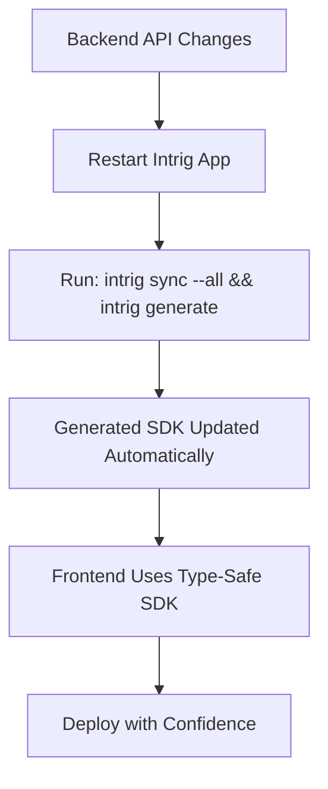

# What Intrig Changes

Intrig fundamentally transforms how teams approach API development by eliminating the traditional barriers between backend and frontend development.

## Traditional API Development Workflow



**Problems:**
- Manual synchronization between backend and frontend
- High potential for human error
- Time-consuming integration cycles
- Inconsistent patterns across projects

## Intrig's Approach



**Benefits:**
- Automatic synchronization
- Zero manual integration work
- Compile-time error detection
- Consistent patterns everywhere

## Key Transformations

### 1. From Manual to Automatic

**Before Intrig:**
```typescript
// Manual HTTP client setup
const response = await fetch('/api/users', {
  method: 'POST',
  headers: {
    'Content-Type': 'application/json',
    'Authorization': `Bearer ${token}`
  },
  body: JSON.stringify(userData)
});

const user = await response.json(); // No type safety
```

**With Intrig:**
```typescript
// Generated, type-safe method
const user = await intrig.users.create(userData); // Full TypeScript support
```

### 2. From Generic to Framework-Optimized

Intrig generates framework-specific code that follows each platform's best practices:

- **React**: Custom hooks with suspense and error boundaries
- **Next.js**: Server actions and route handlers

### 3. From Error-Prone to Type-Safe

**Traditional Approach:**
- Runtime errors from API changes
- Manual type definitions that drift
- No compile-time guarantees

**Intrig Approach:**
- Compile-time error detection
- Always up-to-date types
- Full end-to-end type safety

### 4. From Complex to Simple

**Before:**
- Multiple tools and configurations
- Framework-specific integration patterns
- Manual documentation maintenance

**After:**
- Single command workflow
- Consistent patterns across all frameworks
- Auto-generated documentation

## Impact on Development Velocity

Teams using Intrig report:
- **50% faster** API integration development
- **80% reduction** in API-related bugs
- **Zero time** spent on SDK maintenance
- **Immediate feedback** on API changes

## The Compound Effect

These improvements compound over time:

1. **Week 1**: Faster initial integrations
2. **Month 1**: Reduced debugging and maintenance
3. **Quarter 1**: More time for feature development
4. **Year 1**: Significant competitive advantage

Intrig doesn't just solve individual problems—it transforms your entire API development workflow into a seamless, efficient process.